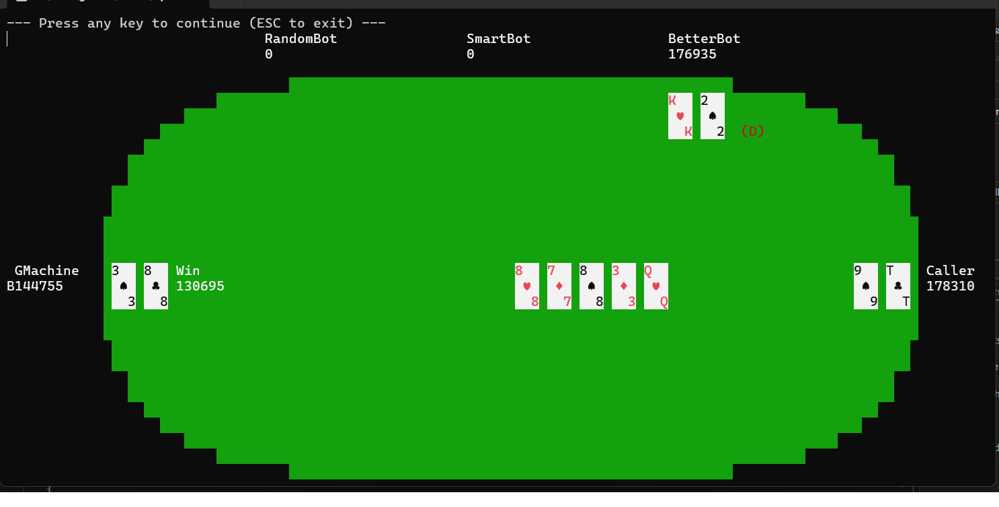
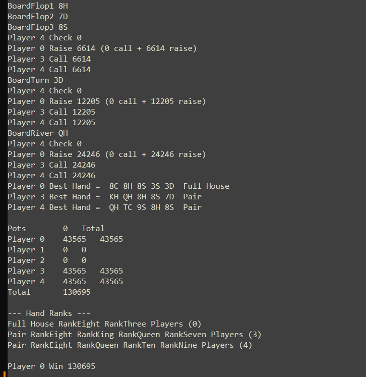

# Holdem Bots

A C# framework for developing and running Texas Hold'em poker bots against each other.

The project separates the **poker game engine** from the **bot implementations**, making it possible to develop and test different poker strategies without modifying the underlying game engine.




## Overview

This is a project I worked on a many years ago to allow people to develop bots to play texas holdem poker against each other.

I primarily developed the backend engine, and a couple of other guys built the UI.
We then ran a competiton where a group of people each developed a bot and then played them off against each other.

A central game controller manages the rules of Texas Hold'em, while individual bots implement their own decision-making strategies.

The repository contains the game engine, the shared player contract, and a collection of example bots ranging from deliberately simple strategies or bots just used for testing, to more sophisticated probability-based approaches.

## Features

- Texas Hold'em game engine
- Pluggable poker bot architecture
- Multiple independent bot implementations
- Configurable blinds and starting stacks
- Configurable number of hands
- Multiple games can be run automatically
- Randomised dealer and seating
- Bot execution timeouts
- Console game display
- Game logging
- Bot timing statistics
- Pot and side-pot management
- Poker hand evaluation
- Observer bots
- XML-based game configuration
- Example bots for testing different strategies

## Project Structure

The solution is divided into three main areas:

```text
holdem-bots
│
├── HoldemController
│   ├── Game engine
│   ├── Deck management
│   ├── Betting
│   ├── Pot management
│   ├── Hand evaluation
│   ├── Console display
│   └── Logging
│
├── HoldemPlayerContract
│   ├── IHoldemPlayer
│   ├── BaseBot
│   ├── Card
│   ├── Hand
│   ├── PlayerInfo
│   └── Game configuration
│
└── Bots
    ├── AllInBot
    ├── BetterBot
    ├── CallerBot
    ├── ExceptionBot
    ├── GMachine
    ├── ObserverBot
    ├── PocketStatsBot
    ├── RaiserBot
    ├── RandomBot
    ├── SleepyBot
    ├── SmartBot
    └── ValidationBot
```

The repository structure is reflected directly in the solution: `HoldemController`, `HoldemPlayerContract` and the collection of bot projects are separate components.

---

## HoldemController

`HoldemController` contains the poker game engine.

Its responsibilities include:

- Creating and shuffling the deck
- Dealing cards
- Managing blinds
- Running betting rounds
- Managing player stacks
- Tracking player contributions
- Managing pots
- Determining when betting rounds are complete
- Evaluating hands at showdown
- Determining winners
- Displaying game information
- Logging games
- Controlling bot execution include running each bot in a sandbox

The project contains dedicated classes for responsibilities such as `Deck`, `HandRanker`, `Pot`, `PotManager`, `ServerHoldemPlayer`, `TextDisplay` and `Program`.

### Game flow

A hand progresses through the normal Texas Hold'em stages:

```text
New Hand
   │
   ▼
Deal Hole Cards
   │
   ▼
Pre-Flop Betting
   │
   ▼
Deal Flop
   │
   ▼
Flop Betting
   │
   ▼
Deal Turn
   │
   ▼
Turn Betting
   │
   ▼
Deal River
   │
   ▼
River Betting
   │
   ▼
Showdown
   │
   ▼
Evaluate Hands
   │
   ▼
Distribute Pots
   │
   ▼
Next Hand
```

The controller then continues playing hands until the configured game-ending condition is reached.

---

## HoldemPlayerContract

`HoldemPlayerContract` defines the interface between the poker engine and individual bots.

The project contains types such as:

- `IHoldemPlayer`
- `BaseBot`
- `Card`
- `Hand`
- `PlayerInfo`
- `GameConfig`
- `ActionType`
- `Stage`
- `EHandType`
- `ERankType`
- `ESuitType`


The important design decision is that a bot does **not** need to know how the game engine implements dealing, betting or pot management.

Instead, the controller communicates with the bot through the player contract.

---

# Bots

The repository includes a number of different bots. They serve both as competitors and as examples of different approaches to implementing poker strategies.

| Bot | Purpose |
|---|---|
| **AllInBot** | This bot goes all-in at every opportunity. This was primary used to test split pots |
| **BetterBot** | Example rule-based poker strategy |
| **CallerBot** | This bots always calls |
| **ExceptionBot** | Used to test exception handling |
| **GMachine** | This is the bot I developed for the competition |
| **ObserverBot** | Observes games without participating |
| **PocketStatsBot** | Uses statistics relating to pocket cards |
| **RaiserBot** | This ones always raises when it can |
| **RandomBot** | Makes random decisions and provides a baseline |
| **SleepyBot** | Used to test timing and timeout behaviour |
| **SmartBot** | More sophisticated hand and board analysis |
| **ValidationBot** | Another observer. The plan was for this to observe and check the game rules are being applied correctly, but this never got developed |


---

## GMachine

`GMachine` is the bot I developed for the competition.

Rather than relying solely on simple fixed rules, it contains separate components for analysing different stages of a hand.

The approach includes probability and equity calculations based on the player's cards, board cards and possible future outcomes.

This makes `GMachine` an example of how the basic `IHoldemPlayer` contract can be used as the foundation for a considerably more complex decision-making system.

---

## SmartBot

`SmartBot` provides another example of a more analytical strategy.

It considers the player's current hand and possible future board cards when determining how strong the hand may become.

The bot contains separate logic for different stages of the game, allowing decisions to change as additional information becomes available.

---

# Configuration

Games are configured using XML.

The default configuration is:

```text
HoldemController/HoldemConfig.xml
```

For example the configuration file could look like this:

```xml
<HoldemConfig>
  <GameRules smallBlind="125" 
             bigBlind="250" 
             startingStack="100000"
             maxNumRaisesPerBettingRound="-1"
             maxHands="-1"
             doubleBlindFrequency="19" 
             botTimeOutMilliSeconds ="5000"
             randomDealer="true" 
             randomSeating="true"
             pauseAfterEachHand="true"
             sleepAfterActionMilliSeconds="500"
             graphicsDisplay="true"
             />
  <Players>
    <Player dll="BetterBot.dll" />
    <Player dll="CallerBot.dll" />
    <Player dll="GMachine.dll" />
    <Player dll="RandomBot.dll" />
    <Player dll="SmartBot.dll" />
    <Player dll="ObserverBot.dll" trusted="true" />
  </Players>
</HoldemConfig>
```

A configuration defines the rules of the game as well as the bots participating in it.

Typical settings include:

| Setting | Description |
|---|---|
| `smallBlind` | Small blind amount |
| `bigBlind` | Big blind amount |
| `startingStack` | Starting chips for each player |
| `maxNumRaisesPerBettingRound` | Maximum raises during a betting round (-1 = no maximum)|
| `maxHands` | Maximum number of hands (-1 = no maximum) |
| `doubleBlindFrequency` | Frequency of blind increases (e.g. double blinds every 19 hands) |
| `botTimeOutMilliSeconds` | Maximum time allowed for a bot to respond |
| `randomDealer` | Randomise the initial dealer |
| `randomSeating` | Randomise player positions |
| `pauseAfterEachHand` | Pause between hands |
| `sleepAfterActionMilliSeconds` | Optional delay after an action |
| `graphicsDisplay` | Whether to show graphical display or console text |

The controller also supports selecting the bot DLLs through the configuration.

This means that changing the participants in a game does not require changing the game engine.

## UI

If graphicsDisplay is true then the game shows the green poker table seen above, if false then it shows text in the console window like the one below.
For testing bots the console text can be useful as it shows more information than the graphical display.
When testing bots it can also be useful to set pauseAfterEachHand = false and sleepAfterActionMilliSeconds = 0 so the games can run without any delays.



---

# Logging

The controller includes a logging subsystem for recording game activity and bot performance.

The repository contains a dedicated `Logging` component as well as the controller's console display functionality.

Logging can be useful when:

- Debugging a bot
- Investigating an unexpected decision
- Comparing strategies
- Measuring bot execution time
- Analysing large numbers of games

Three main log files are written during a run. They are:

* CallLog - This records all of the bot methods that were called by the controller, the parameters used, and how long each took
* GameLog - This records the same information that is displayed in the Console when graphicsDisplay = false.
* PlayerInfo - Summary stats for each player - their stack size after each hand, how many hands played, how many showdowns, how many won etc.


---


# Running the Project

The repository is a Visual Studio solution:

```text
Holdem.sln
```

The controller is the executable application, while the individual bots are compiled separately and loaded by the controller.

The general workflow is:

```text
Build Solution
      │
      ▼
Build Bot DLLs
      │
      ▼
Configure HoldemConfig.xml
      │
      ▼
Run HoldemController
      │
      ▼
Bots play against each other
      │
      ▼
Review logs/results
```

## Command-line arguments

The controller supports a configuration file and number of games as arguments:

```text
HoldemController.exe [config-file] [number-of-games]
```

For example:

```text
HoldemController.exe HoldemConfig.xml 100
```

can be used to run the configured game repeatedly.

Running multiple games is particularly useful when comparing strategies because the result of a single poker game is heavily influenced by variance.

---

# Developing a New Bot

The intended extension point of the framework is the player contract.

A typical development process is:

### 1. Create a new project

Create a new C# class library for the bot.

### 2. Reference `HoldemPlayerContract`

The bot should reference the shared player contract.

### 3. Inherit from `BaseBot`

`BaseBot` provides a convenient starting point for creating a new poker bot.

A new bot can inherit from `BaseBot` and implement its own decision-making logic.

For example:

```csharp
public class MyBot : BaseBot
{
    public override string Name => "MyBot";

    public override void GetAction(
        Stage stage,
        int betSize,
        int callAmount,
        int minRaise,
        int maxRaise,
        int raisesRemaining,
        int potSize,
        out ActionType action,
        out int amount)
    {
        action = ActionType.Call;
        amount = callAmount;
    }
}
```

### 4. Implement the decision-making logic

Override the appropriate methods to respond to the information supplied by the game engine.

For example:

```text
ReceiveHoleCards
       │
       ▼
Maintain Bot State
       │
       ▼
Observe Board / Actions
       │
       ▼
GetAction
       │
       ▼
Fold / Check / Call / Raise
```

### 5. Build the bot

The project produces a DLL.

### 6. Add the bot to the game configuration

The DLL can then be included in the game's player configuration.

This allows the same game engine to run the new strategy against the existing bots.

---

# Design

One of the main strengths of the project is the separation of **game mechanics** and **strategy**.

The architecture can be thought of as:

```text
                 ┌──────────────────┐
                 │  HoldemController│
                 │                  │
                 │ Game Rules       │
                 │ Deck             │
                 │ Betting          │
                 │ Pots             │
                 │ Showdown         │
                 └────────┬─────────┘
                          │
                    Player Contract
                          │
          ┌───────────────┼───────────────┐
          │               │               │
          ▼               ▼               ▼
      RandomBot       SmartBot        GMachine
          │               │               │
          └───────────────┼───────────────┘
                          │
                       Results
```

This architecture provides several benefits:

- New strategies can be developed independently.
- The game engine does not need to know how a bot makes decisions.
- Multiple strategies can compete under identical rules.
- Simple bots can be used as baselines.
- More complex strategies can be developed incrementally.
- Bots can be tested against each other repeatedly.

---

# Technologies

- **C#**
- **.NET Framework 4.8**
- **Visual Studio**
- **MSBuild**
- **XML configuration**
- **Class libraries / DLLs**
- **Object-oriented design**

The repository is based on the older .NET Framework project structure rather than the modern SDK-style .NET project format.

---

# What This Project Demonstrates

This project demonstrates several software engineering concepts:

- Designing a reusable interface between a framework and external implementations
- Separating business logic from strategy
- Object-oriented design
- Event/callback-based communication
- Dynamic loading of bot implementations
- State management
- Game-state modelling
- Algorithmic decision-making
- Probability and equity calculations
- Logging and diagnostics
- Handling untrusted or potentially faulty bot behaviour
- Running repeated simulations

It also provides an interesting example of applying software engineering techniques to a problem where **decision quality is probabilistic rather than deterministic**.

---

# Limitations

This project is primarily an experimentation and development framework rather than a production poker platform.

The included bots use different levels of sophistication and should not be considered optimal Texas Hold'em strategies.

Poker outcomes also contain substantial variance, so comparing bots over a small number of games can produce misleading results.

The project also targets the older **.NET Framework 4.8**, which makes it less suitable for modern environments without additional migration work.


---

# License

This project is licensed under the MIT License.

See [LICENSE](LICENSE) for details.